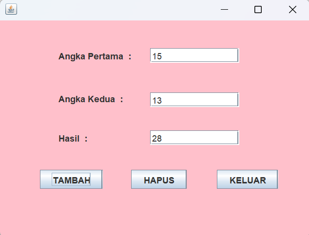

# Aplikasi Pertambahan dua angka
 Latihan 1 - Annisa (2210010581)
 
# Aplikasi Pertambahan dua angka
 
Aplikasi Pertambahan dua angka Adalah Aplikasi untuk Tambah dari dua angka yang ada

# Pembuat Aplikasi
 Annisa - 2210010581 - Latihan 1

# Fitur

Aplikasi ini menawarkan fitur:

Penghitungan Tambah Dua Angka  

## Cara Menjalankan

1. Run File
2. Ketikkan Angka Pertama Yang Kita Input
3. Ketikkan Angka Kedua Yang Kita Input
4. Ketik Button Tambah maka akan terlihat hasilnya
5. Jika ingin mengganti angkanya klik button Hapus
4. Tekan Button Keluar, jika ingin keluar 

# Demo
# KalkulatorTambah
 
